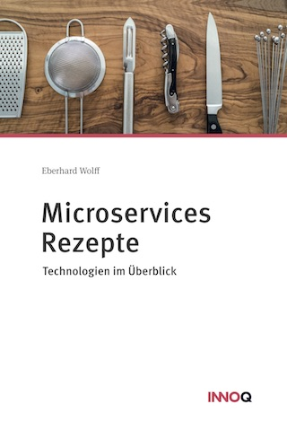

Microservices Rezepte
---

Diese Broschüre zeigt Technologie-Rezepte für die Implementierung von
Microservices. Die Beispiele stehen als Code zum Download bereit.

 

## Inhalt

* Was sind Microservices?
  - Independent Systems Architecture Principles
  - Self-contained Systems

* UI-Integration
  - Warum UI-Integration?
  - Rezept: ESI (Edge Side Includes)
  - Alternative Rezepte: Links und JavaScript

* Asynchrone Microservices
  - Definition: Asynchrone Microservices
  - Warum asynchrone Microservices?
  - Rezept: Kafka
  - Alternatives Rezept: Atom

* Synchrone Microservices
  - Definition: Synchrone Microservices
  - Warum synchrone Microservices?
  - Rezept: Kubernetes
  - Alternative Rezepte: Netflix, Consul, Cloud Foundry

## Herunterladen

Das eBook gibt es kostenlos bei Leanpub in den Formaten PDF, ePub und
Mobi (Kindle). Das eBook ist nicht durch DRM (digital rights
management) geschützt.

<https://leanpub.com/microservices-rezepte/>

Ansonsten gibt es die kostenpflichtige Kindle- und Papier-Version bei Amazon:

<iframe style="width:120px;height:240px;" marginwidth="0"
marginheight="0" scrolling="no" frameborder="0"
src="//ws-eu.amazon-adsystem.com/widgets/q?ServiceVersion=20070822&OneJS=1&Operation=GetAdHtml&MarketPlace=DE&source=ss&ref=as_ss_li_til&ad_type=product_link&tracking_id=springbuch-21&marketplace=amazon&region=DE&placement=1979140022&asins=1979140022&linkId=ae077ac5bb743771250ea8e0ac3f447c&show_border=true&link_opens_in_new_window=true"></iframe>
<iframe style="width:120px;height:240px;" marginwidth="0" marginheight="0" scrolling="no" frameborder="0" src="//ws-eu.amazon-adsystem.com/widgets/q?ServiceVersion=20070822&OneJS=1&Operation=GetAdHtml&MarketPlace=DE&source=ss&ref=as_ss_li_til&ad_type=product_link&tracking_id=springbuch-21&marketplace=amazon&region=DE&placement=B076X4RC4Y&asins=B076X4RC4Y&linkId=a09a809a9ce08cc64a5057442c8250b5&show_border=true&link_opens_in_new_window=true"></iframe>

